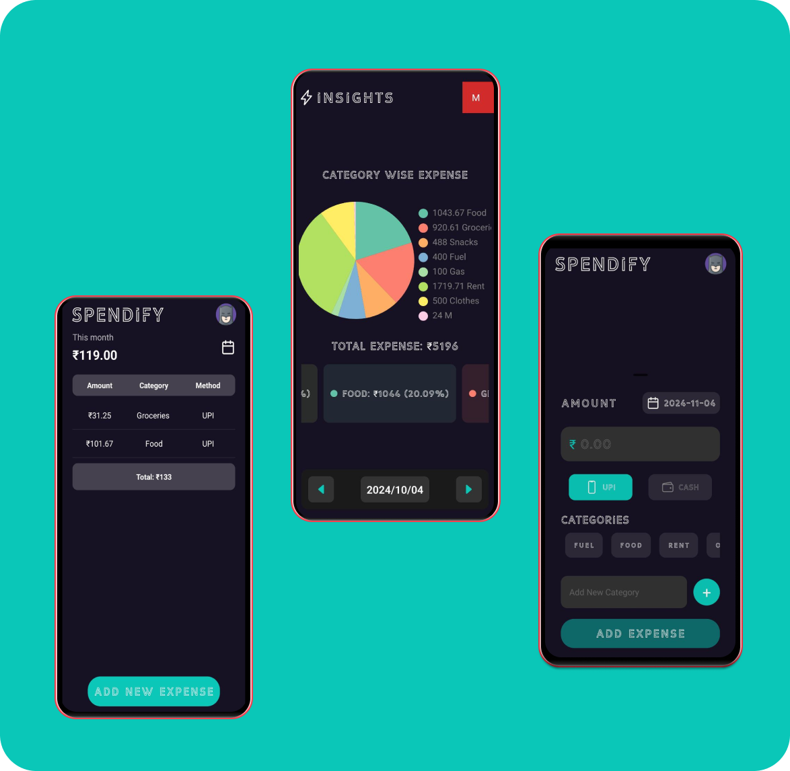

# Spendify

Spendify is an expense tracker app that allows you to monitor your daily expenses category-wise. The app provides a detailed breakdown of your expenses and insights to help you manage your budget better.

## Screenshots



## Features

- Track expenses by category
- View total monthly expenses
- Add new expenses with ease
- Visual insights with pie charts

## Installation

1. Clone the repository:
    ```bash
    git clone https://github.com/Nareshram1/spendify.git
    ```
2. Navigate to the project directory:
    ```bash
    cd spendify
    ```
3. Install dependencies:
    ```bash
    npm install
    ```
4. Start the application:
    ```bash
    npm start
    ```

## Usage

1. Open the app and log in.
2. Navigate to the "Add Expense" section to add a new expense.
3. View your total and category-wise expenses in the "Insights" section.

## Contributing

1. Fork the repository.
2. Create your feature branch:
    ```bash
    git checkout -b feature/YourFeature
    ```
3. Commit your changes:
    ```bash
    git commit -m 'Add some feature'
    ```
4. Push to the branch:
    ```bash
    git push origin feature/YourFeature
    ```
5. Open a pull request.

## License

This project is licensed under the MIT License.
