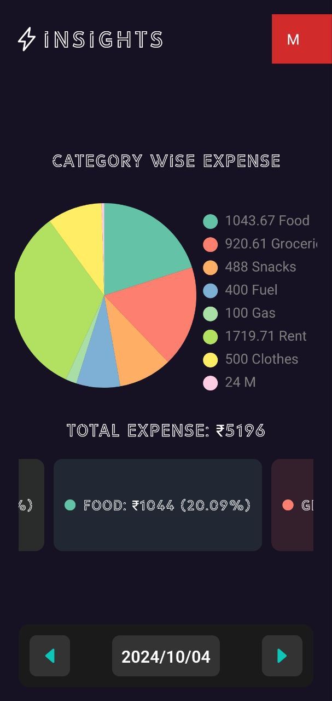

# Spendify

Spendify is a mobile application designed to help users track and manage their expenses efficiently. The app provides insights into spending patterns and allows users to categorize their expenses for better financial planning.

## Features

- **Insights Dashboard**: Visual representation of expenses categorized by type.
- **Expense Tracking**: List and summary of monthly expenses.
- **Add New Expense**: Easy-to-use interface for adding new expenses with categories and payment methods.

## Screenshots

### Insights Dashboard

This screen provides a pie chart representation of expenses categorized by type, along with the total expense for the selected period.

### Monthly Expenses

This screen lists the expenses for the current month, providing details such as amount, category, and payment method.

### Add Expense

This screen allows users to add a new expense by selecting the category, payment method, and amount.

## Installation

To install and run the application on your local machine, follow these steps:

1. Clone the repository:
   ```bash
   git clone https://github.com/yourusername/spendify.git
   ```
2. Navigate to the project directory:
   ```bash
   cd spendify
   ```
3. Install the dependencies:
   ```bash
   npm install
   ```
4. Run the application:
   ```bash
   npm start
   ```

## Usage

- Open the application on your mobile device or emulator.
- Navigate through the insights dashboard to get an overview of your spending patterns.
- Check the monthly expenses to see a detailed list of your expenditures.
- Use the add expense screen to record new expenses as they occur.

## Contributing

Contributions are welcome! Please fork the repository and create a pull request with your changes.

1. Fork the repository.
2. Create a new branch:
   ```bash
   git checkout -b feature/your-feature-name
   ```
3. Make your changes and commit them:
   ```bash
   git commit -m "Add some feature"
   ```
4. Push to the branch:
   ```bash
   git push origin feature/your-feature-name
   ```
5. Create a pull request.

## License

This project is licensed under the MIT License.
